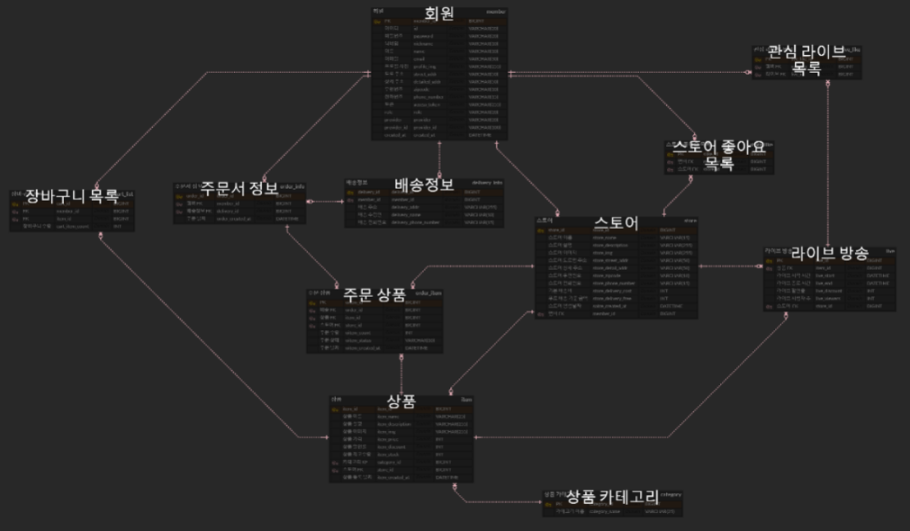

# 팜 컴어스 👩‍🌾🥕 

## - 온라인 농산물 직거래 플랫폼

<!-- 필수 항목 -->

### 카테고리

| Application                       | Domain                                | Language                      | Framework                            |
| --------------------------------- | ------------------------------------- | ----------------------------- | ------------------------------------ |
| :white_check_mark: Desktop Web    | :black_square_button: AI              | :white_check_mark: JavaScript | :black_square_button: Vue.js         |
| :white_check_mark: Mobile Web     | :black_square_button: Big Data        | :black_square_button: TypeScript | :white_check_mark: React          |
| :white_check_mark: Responsive Web | :black_square_button: Blockchain      | :black_square_button: C/C++   | :black_square_button: Angular        |
| :black_square_button: Android App | :black_square_button: IoT             | :black_square_button: C#      | :black_square_button: Node.js        |
| :black_square_button: iOS App     | :black_square_button: AR/VR/Metaverse | :black_square_button: Python  | :black_square_button: Flask/Django   |
| :black_square_button: Desktop App | :black_square_button: Game            | :white_check_mark: Java       | :white_check_mark: Spring/Springboot |
|                                   |                                       | :black_square_button: Kotlin  |                                      |

<!-- 필수 항목 -->

## 프로젝트 소개

- 프로젝트명: 팜컴어스
- 서비스 특징: 웹/모바일(웹 기술)을 활용한 온라인 농산물 직거래 라이브 커머스 서비스
- 주요 기능
  - 회원 관리
  - 스마트 스토어
  - 농산물 직거래 라이브
  - 라이브 채팅
  - 농산물 상품 결제
- 주요 기술
  - WebRTC
  - WebSocket
  - JWT Authentication
  - OAuth2.0 기반 회원 인증
  - REST API
- 참조 리소스

- 배포 환경
  - URL: 배포 예정
  - 테스트 계정:

<!-- 자유 양식 -->

## 팀 소개 - 일이삼사오🎉

- 김지희: 팀장, 백엔드 개발, API 개발 및 문서 관리, 회원 인증
- 차현경: 백엔드 개발, WebRtc 인프라 담당, CI/CD, HTTPS, Docker 구성
- 이지은: 백엔드 개발 및 결제 시스템 담당
- 이정현: 프론트엔드 리더, 와이어프레임 작성 및 WebRtc 기술 담당
- 김성중: 프론트엔드 개발, 카카오 API 담당
- 김태영: 프론트엔드 개발, UCC 담당
   
<!-- 자유 양식 -->

## 프로젝트 상세 설명 

### 🥕 팜컴어스는 농가와 소비자를 바로 이어 유통 과정에서 발생하는 마진과 상품 손상을 방지하여 소비자에게 합리적인 가격에 신선한 작물을 제공해주는 라이브 플랫폼입니다.

### 🥕 <b>서비스 설명/주요기능 </b>

1. 라이브커머스 도중 목표판매 재고가 빠지는걸 실시간으로 확인 가능.
   ( 생동감 있는 라이브 판매 시각화 )

2. KAMIS(농산물유통정보) API의 데이터를 가공해, 농부에게는 적정시세 가이드 라인을, 소비자에게는 현재가격이 얼마나 저렴한지 한눈에 보여줄 수 있음. (거래 활성화 효과, 판매자와 구매자 입장의 UI가 다름)

3. 농부 입장에서 스토어 관리를 통해 매출 추이를 그래프화시켜서 볼 수 있음.

4. 가입부터 결제까지 매끄럽게 이어지는 UX 흐름, 판매자 입장을 고려한 쉬운 라이브 등록

<!-- // 개발 환경, 기술 스택, 시스템 구성도, ERD, 기능 상세 설명 등 -->

## 기술 스택

## ERD

## 와이어 프레임

👉🏻[와이어프레임 보러가기](https://www.figma.com/file/7hqnEIqEnz7Ie2u7b3MlFz/Untitled?t=wZac7adufZbT6cHS-0)
